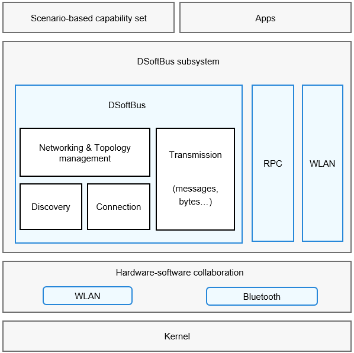

# DSoftBus

## Introduction

The DSoftBus subsystem provides the following communication capabilities for OpenHarmony:

- Remote procedure call (RPC): communications between processes on a device or across devices.


## Architecture

**Figure 1** DSoftBus architecture




## Directory Structure

The DSoftBus directory structure is as follows:

```
foundation/communication/communication_cangjie_api
├── ohos             # Cangjie DSoftBus code
├── kit              # Cangjie kit code
├── figures          # architecture pictures
```

## Constraints

The devices must be in the same LAN.

## Usage

### RPC

In an RPC, the client process obtains the proxy of the process that provides the service (server). Through the proxy, the two processes communicate with each other.

1.  Implement the server capabilities.
2.  The client obtains a proxy of the server. This proxy provides the same capabilities as the server. To call a method of the server, the client only needs to call the same method of the proxy.
3.  The server processes the received request and returns the result to the proxy via the driver.
4.  The proxy returns the result to the client.

## Repositories Involved

**DSoftBus subsystem**

communication_cangjie_api

[communication\_ipc](https://gitee.com/openharmony/communication_ipc)
