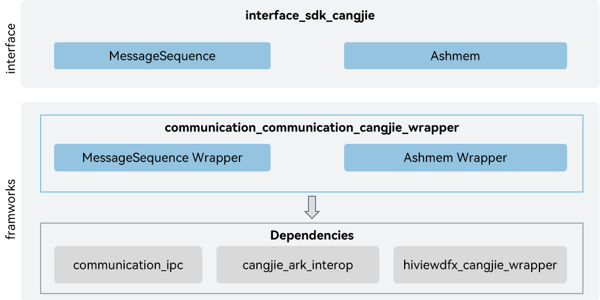

# communication_cangjie_wrapper

## Introduction

The Distributed Softbus Cangjie API is a Cangjie API encapsulated on OpenHarmony based on the capabilities of the Distributed Softbus Subsystem. The distributed soft bus subsystem is designed to provide communication-related capabilities for the OpenHarmony system. The currently open distributed soft bus Cangjie interface only supports standard devices.

## System Architecture

**Figure 1** Diagram of the Cangjie architecture of distributed soft bus



As shown in the architecture diagram:

- MessageSequence: Provides the data format used for communication.
- Ashmem: Provides methods related to anonymous shared memory objects.
- Cangjie distributed soft bus FFI interface definition: Responsible for defining the C-interoperable Cangjie interface, which is used to realize Cangjie's distributed soft bus capabilities.
- Remote Procedure Call: Responsible for providing basic RPC functions, and encapsulating the C interface to provide Cangjie for interoperability.

## Directory Structure

The DSoftBus directory structure is as follows:

```
foundation/communication/communication_cangjie_wrapper
├── figures             # architecture pictures
├── kit                 # Cangjie IPC Kit interface
│   └── IPCKit
├── ohos                # Cangjie IPC code
│   └── rpc
└── test                # Cangjie test cases
```

## Usage

The current distributed soft bus Cangjie interface provides the following functions:

- Provides basic types and data formats for communication, such as arrays, IPC objects, interface descriptors, and custom serialization objects.
- Provides methods related to anonymous shared memory objects, including creating, closing, mapping, and unmapping Ashmem, reading and writing data from Ashmem, getting Ashmem size, and setting Ashmem protection.

Compared with ArkTS, the following functions are not supported at the moment:

- Implement IRemoteObject proxy objects.
- Obtain IPC context information, including obtaining UID and PID, obtaining local and peer device IDs, and checking whether interface calls are on the same device.
- Implement remote objects.

See Camera APIs[ohos.rpc (RPC Communication)](https://gitcode.com/openharmony-sig/arkcompiler_cangjie_ark_interop/blob/master/doc/API_Reference/source_en/apis/IPCKit/cj-apis-rpc.md).For guidance, please refer to[RPC Development Guide](https://gitcode.com/openharmony-sig/arkcompiler_cangjie_ark_interop/blob/master/doc/Dev_Guide/source_en/ipc/cj-ipc-rpc-overview.md).

## Code Contribution

Developers are welcome to contribute code, documentation, etc. For specific contribution processes and methods, please refer to [Code Contribution](https://gitcode.com/openharmony/docs/blob/master/en/contribute/code-contribution.md).

## Repositories Involved

[cangjie\_ark\_interop](https://gitcode.com/openharmony-sig/arkcompiler_cangjie_ark_interop)

[hiviewdfx\_cangjie\_wrapper](https://gitcode.com/openharmony-sig/hiviewdfx_hiviewdfx_cangjie_wrapper)


[communication\_ipc](https://gitee.com/openharmony/communication_ipc)
