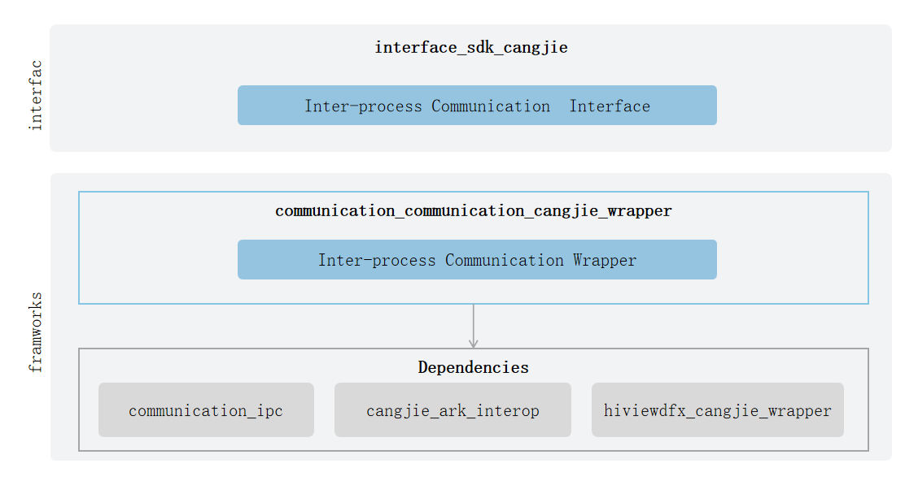

# Inter-Process Communication Cangjie Wrapper(beta feature)

## Introduction

In the OpenHarmony platform, the Inter-Process Communication Cangjie wrapper provides developers with cross-process communication capabilities needed for application development using the Cangjie language. IPC (Inter-Process Communication) and RPC (Remote Procedure Call) mechanisms are used to implement cross-process communication. The former uses the Binder driver for cross-process communication within a device, while the latter uses the soft bus driver for cross-device cross-process communication. Typical IPC scenarios are in background services, where the application's background service provides cross-process service invocation capabilities through the IPC mechanism. Typical RPC usage scenarios are in multi-end collaboration, where multi-end collaboration provides remote interface invocation and data transmission capabilities through the RPC mechanism. Currently, the open distributed soft bus Cangjie interface only supports standard devices.

## System Architecture

**Figure 1** Inter-process Communication Cangjie Architecture Diagram



As shown in the architecture diagram:

Interface layer:

Interprocess Communication function interface: API capabilities for cross-process communication provided to developers, mainly including the following functions:

- Anonymous shared memory objects: Provide methods related to anonymous shared memory objects, including creating, closing, mapping and unmapping Ashmem, reading data from and writing data to Ashmem, obtaining the size of Ashmem, and setting Ashmem protections.

- Message sequence: During RPC or IPC processes, the sender can use the write methods provided by MessageSequence to write the data to be sent into the object in a specific format. The receiver can use the read methods provided by MessageSequence to read data in the specific format from the object. The data formats include: basic types and their corresponding arrays, file descriptors (fd), interface descriptors, anonymous shared memory objects, and custom serialized objects.

Framework layer:

- Cross-process communication function encapsulation: Implementation encapsulation of Cangjie cross-process communication, providing message sequence and anonymous shared memory object capabilities.

Explanation of dependent components introduced in the architecture diagram:

- IPC/RPC component: Responsible for providing basic RPC functions, encapsulating C language interfaces for Cangjie interoperability.

- cangjie_ark_interop: Responsible for providing Cangjie annotation class definitions for API annotation, and providing BusinessException exception class definitions thrown to users.

- hiviewdfx_cangjie_wrapper: Responsible for providing log interfaces for printing logs at critical paths.

## Directory Structure

The main code directory structure of the Inter-Process Communication Cangjie is as follows:

```
foundation/communication/communication_cangjie_wrapper
├── figures                             # architecture pictures
├── kit                                 # Cangjie IPC Kit interface
│   └── IPCKit
├── ohos                                # Cangjie IPC code
│   └── rpc
│       ├── message_sequence.cj         # The interface for MessageSequence
│       └── ashmem.cj                   # The interface for Ashmem
└── test                                # Cangjie test cases
    └── rpc                             # rpc test cases
```

## Usage

The current distributed soft bus Cangjie interface provides the following functions:

- Provides methods related to anonymous shared memory objects, including creating, closing, mapping and unmapping Ashmem, reading data from and writing data to Ashmem, obtaining the size of Ashmem, and setting Ashmem protection. 

- Provides basic types (signed integer, single-precision float, double-precision float, boolean, character, string) and arrays of basic types, file descriptors (fd), interface descriptors, anonymous shared memory objects, and custom serialized objects for communication purposes.

See Camera APIs[RPC Communication](https://gitcode.com/openharmony-sig/arkcompiler_cangjie_ark_interop/blob/master/doc/API_Reference/source_en/apis/IPCKit/cj-apis-rpc.md).For guidance, please refer to[RPC Development Guide](https://gitcode.com/openharmony-sig/arkcompiler_cangjie_ark_interop/blob/master/doc/Dev_Guide/source_en/ipc/cj-ipc-rpc-overview.md).

## Constraints

- When communicating across processes on a single device, the maximum amount of data that can be transmitted is 200KB. For data exceeding 200KB, please use anonymous shared memory.

- Compared with the API capabilities provided by ArkTS, the following functions are currently not supported:
  - Remote object communication.
  - OneWay

## Code Contribution

Developers are welcome to contribute code, documentation, etc. For specific contribution processes and methods, please refer to [Code Contribution](https://gitcode.com/openharmony/docs/blob/master/en/contribute/code-contribution.md).

## Repositories Involved

[arkcompiler_cangjie_ark_interop](https://gitcode.com/openharmony-sig/arkcompiler_cangjie_ark_interop)

[communication_ipc](https://gitcode.com/openharmony/communication_ipc)

[hiviewdfx_hiviewdfx_cangjie_wrapper](https://gitcode.com/openharmony-sig/hiviewdfx_hiviewdfx_cangjie_wrapper)
