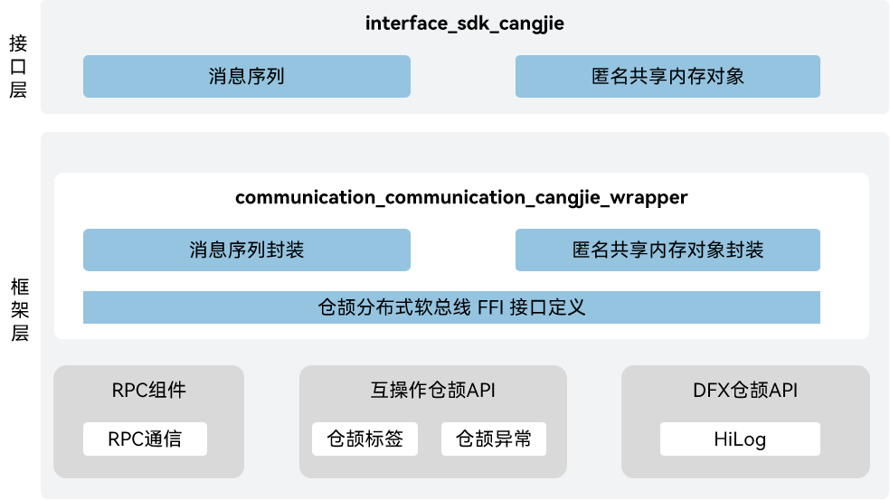

# 进程间通信仓颉封装

## 简介

在OpenHarmony平台上，进程间通信仓颉封装为开发者提供了使用仓颉语言进行应用开发时所需的跨进程通信相关的能力。IPC（Inter-Process Communication）与RPC（Remote Procedure Call）机制用于实现跨进程通信，不同的是前者使用Binder驱动，用于设备内的跨进程通信，而后者使用软总线驱动，用于跨设备跨进程通信。IPC典型场景在后台服务，应用的后台服务通过IPC机制提供跨进程的服务调用能力，RPC典型使用场景在多端协同，多端协同通过RPC机制提供远端接口调用与数据传递能力。当前开放的进程间通信仓颉接口仅支持standard设备。

## 系统架构

**图 1** 进程间通信仓颉架构图



接口层：

进程间通信功能接口：面向开发者提供的进程间通信的API能力，主要包括以下功能：

- 匿名共享内存对象：提供与匿名共享内存对象相关的方法，包括创建、关闭、映射和取消映射Ashmem、从Ashmem读取数据和写入数据、获取Ashmem大小、设置Ashmem保护。
- 消息序列：在RPC或IPC过程中，发送方可以使用MessageSequence提供的写方法，将待发送的数据以特定格式写入该对象。接收方可以使用MessageSequence提供的读方法从该对象中读取特定格式的数据。数据格式包括：基础类型及对应的数组、fd、接口描述符、匿名共享内存对象和自定义序列化对象。

框架层：

- 进程间通信功能封装：仓颉进程间通信的实现封装，提供消息序列以及匿名共享内存对象的能力。

架构图中的依赖部件引入说明：

- IPC/RPC组件：负责提供RPC基础功能，封装C语言接口提供给仓颉进行互操作。
- cangjie_ark_interop：负责提供仓颉注解类定义，用于对API进行标注，以及提供抛向用户的BusinessException异常类定义。
- hiviewdfx_cangjie_wrapper：负责提供日志接口，用于在关键路径处打印日志。

## 目录

进程间通信仓颉主要代码目录结构如下：

```
foundation/communication/communication_cangjie_wrapper
├── figures                             # 存放README中的架构图
├── kit                                 # 仓颉IPC kit化接口
│   └── IPCKit
├── ohos                                # 仓颉IPC接口实现
│   └── rpc
│       ├── message_sequence.cj         # 消息序列接口
│       └── ashmem.cj                   # 匿名共享内存对象接口
└── test                                # 仓颉测试用例
    └── rpc                             # rpc测试用例
```

## 使用说明

当前进程间通信仓颉接口提供了以下功能：

- 提供与匿名共享内存对象相关的方法，包括创建、关闭、映射和取消映射Ashmem、从Ashmem读取数据和写入数据、获取Ashmem大小、设置Ashmem保护。
- 提供有符号整型、无符号整型、单精度浮点数、双精度浮点数、布尔类型、字符、字符串及对应的数组、fd、接口描述符、匿名共享内存对象和自定义序列化对象这些用来通信的数据格式。

RPC相关API请参见[RPC通信](https://gitcode.com/openharmony-sig/arkcompiler_cangjie_ark_interop/blob/master/doc/API_Reference/source_zh_cn/apis/IPCKit/cj-apis-rpc.md)，相关指导请参见[RPC开发指南](https://gitcode.com/openharmony-sig/arkcompiler_cangjie_ark_interop/blob/master/doc/Dev_Guide/source_zh_cn/ipc/cj-ipc-rpc-overview.md)。

## 约束

- 单个设备上跨进程通信时，传输的数据量最大为200KB。超过200KB的数据量请使用匿名共享内存。

- 与ArkTS提供的API能力相比，暂不支持以下功能：
  - 远程对象通信。

## 参与贡献

欢迎广大开发者贡献代码、文档等，具体的贡献流程和方式请参见[参与贡献](https://gitcode.com/openharmony/docs/blob/master/zh-cn/contribute/%E5%8F%82%E4%B8%8E%E8%B4%A1%E7%8C%AE.md)。

## 相关仓

[arkcompiler_cangjie_ark_interop](https://gitcode.com/openharmony-sig/arkcompiler_cangjie_ark_interop)

[communication_ipc](https://gitcode.com/openharmony/communication_ipc)

[hiviewdfx_hiviewdfx_cangjie_wrapper](https://gitcode.com/openharmony-sig/hiviewdfx_hiviewdfx_cangjie_wrapper)
