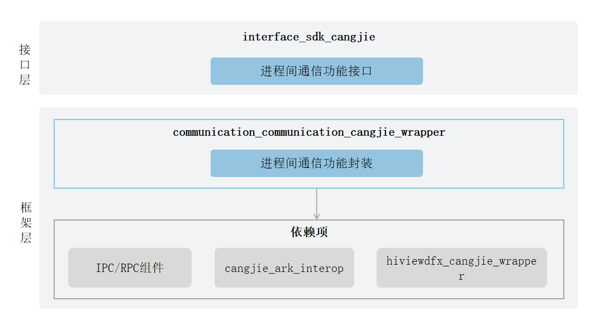

# 分布式软总线仓颉<a name="ZH-CN_TOPIC_0000001090266209"></a>

## 简介<a name="section11660541593"></a>

分布式软总线仓颉旨在为OpenHarmony系统提供的通信相关的能力，包括：进程间通信RPC（Remote Procedure Call）等通信能力。

进程间通信：提供不区分设备内或设备间的进程间通信能力。

## 系统架构<a name="section342962219551"></a>

**图 1**  分布式软总线仓颉架构图<a name="fig4460722185514"></a>  




## 目录<a name="section161941989596"></a>

分布式软总线仓颉主要代码目录结构如下：

```
foundation/communication/communication_cangjie_wrapper
├── ohos             # 仓颉IPC接口实现
├── kit              # 仓颉kit化代码
├── figures          # 存放readme中的架构图
```

## 约束<a name="section119744591305"></a>

-   组网限制：必须确保设备在同一个局域网中。

## 使用说明<a name="section1312121216216"></a>

### 进程间通信<a name="section129654513264"></a>

在使用RPC时，请求服务的一端进程可获取提供服务一端所在进程的代理 （Proxy），并通过此代理读写数据来实现进程间的数据通信，其详细过程如下：

1.  实现服务端及其提供的能力。
2.  请求服务的一端会建立一个服务提供端的代理对象，这个代理对象具备和服务提供端一样的功能，若想访问服务提供端中的某个方法，只需要访问代理对象中对应的方法即可。
3.  服务提供端处理接收到的请求，处理完之后通过驱动返回处理结果给代理对象。
4.  代理对象将请求结果进一步返回给请求服务端。

## 相关仓<a name="section1371113476307"></a>

**分布式软总线仓颉**

communication_cangjie_wrapper

[communication\_ipc](https://gitee.com/openharmony/communication_ipc)
